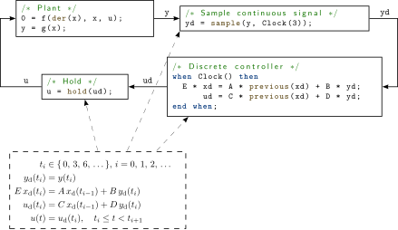
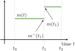
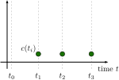
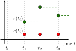

== Synchronous Language Elements
:id: synchronous-language-elements

This chapter defines synchronous behavior suited for implementation of control systems.
The synchronous behavior relies on an additional kind of discrete-time variables and equations, as well as an additional kind of `when`-clause.
The benefits of synchronous behavior is that it allows a model to define large sampled data systems in a safe way, so that the translator can provide good diagnostics in case of a modeling error.

The following small example shows the most important elements:

.A continuous plant and a sampled data controller connected together with sample and (zero-order) hold elements.

* A periodic clock is defined with `Clock(3)`. The argument of `Clock` defines the sampling interval (for details see <<clock-constructors>>).
* Clocked variables (such as `yd`, `xd`, `ud`) are associated uniquely with a clock and can only be directly accessed when the associated clock is active. Since all variables in a clocked equation must belong to the same clock, clocking errors can be detected at compile time. If variables from different clocks shall be used in an equation, explicit cast operators must be used, such as `sample` to convert from continuous-time to clocked discrete-time or `hold` to convert from clocked discrete-time to continuous-time.
* A continuous-time variable is sampled at a clock tick with `sample`. The operator returns the value of the continuous-time variable when the clock is active.
* When no argument is defined for `Clock`, the clock is deduced by clock inference.
* For a `when`-clause with an associated clock, all equations inside the `when`-clause are clocked with the given clock. All equations on an associated clock are treated together and in the same way regardless of whether they are inside a `when`-clause or not. This means that automatic sampling and hold of variables inside the `when`-clause does not apply (explicit sampling and hold is required) and that general equations can be used in such `when`-clauses (this is not allowed for `when`-clauses with `Boolean` conditions, that require a variable reference on the left-hand side of an equation).
* The `when`-clause in the controller could also be removed and the controller could just be defined by the equations:
[source,modelica]
----
/* Discrete controller */
E * xd = A * previous(xd) + B * yd;
    ud = C * previous(xd) + D * yd;
----
* `previous(xd)` returns the value of `xd` at the previous clock tick. At the first sample instant, the start value of `xd` is returned.
* A discrete-time signal (such as `ud`) is converted to a continuous-time signal with `hold`.
* If a variable belongs to a particular clock, then all other equations where this variable is used, with the exception of as argument to certain special operators, belong also to this clock, as well as all variables that are used in these equations. This property is used for clock inference and allows defining an associated clock only at a few places (above only in the sampler, whereas in the discrete controller and the hold the sampling period is inferred).
* The approach in this chapter is based on the clock calculus and inference system proposed by Colaco & Pouzet (2003) and implemented in Lucid Synchrone version 2 and 3 (Pouzet 2006). However, the Modelica approach also uses multi-rate periodic clocks based on rational arithmetic introduced by Forget et al. (2008), as an extension of the Lucid Synchrone semantics. These approaches belong to the class of synchronous languages (Benveniste et al. 2003).

=== Rationale for Clocked Semantics

[NOTE]
Periodically sampled control systems could also be defined with standard `when`-clauses, see <<when-equations>>, and the `sample` operator, see <<event-related-operators-with-function-syntax>>.
For example:
[source,modelica]
----
when sample(0, 3) then
  xd = A * pre(xd) + B * y;
  u  = C * pre(xd) + D * y;
end when;
----

Equations in a `when`-clause with a `Boolean` condition have the property that (a) variables on the left hand side of the equal sign are assigned a value when the when-condition becomes true and otherwise hold their value, (b) variables not assigned in the `when`-clause are directly accessed (= automatic `sample` semantics), and (c) the variables assigned in the `when`-clause can be directly accessed outside of the `when`-clause (= automatic `hold` semantics).

Using standard `when`-clauses works well for individual simple sampled blocks, but the synchronous approach using clocks and clocked equations provide the following benefits (especially for large sampled systems):

. Possibility to detect inconsistent sampling rate, since clock partitioning (see <<clock-partitioning>>), replaces the automatic sample and hold semantics.
. Fewer initial conditions are needed, as only a subset of clocked variables need initial conditions -- the clocked state variables (see <<clocked-state-variables>>).
. More general equations can be used, compared to standard `when`-clauses that require a restricted form of equations where the left hand side has to be a variable, in order to identify the variables that are assigned in the `when`-clause.
. Clocked equations allow clock inference, meaning that the sampling need only be given once for a sub-system.
. Possible to use general continuous-time models in synchronous models (e.g., some advanced controllers use an inverse model of a plant in the feedforward path of the controller).
. Clocked equations are straightforward to optimize because they are evaluated exactly once at each event instant.
. Clocked subsystems using arithmetic blocks are straightforward to optimize.

=== Definitions

==== Clocks and Clocked Variables

In <<discrete-time-expressions>> the term _discrete-time_ Modelica expression and in <<continuous-time-expressions>> the term _continuous-time_ Modelica expression is defined.
In this chapter, two additional kinds of discrete-time expressions/variables are defined that are associated to clocks and are therefore called _clocked discrete-time_ expressions.

The different kinds of discrete-time variables in Modelica are defined below.

.Definition: Piecewise-constant variable
Variables m(t) of base type `Real`, `Integer`, `Boolean`, enumeration, and `String` that are constant inside each interval t_i ≤ t < t_{i+1} (i.e., piecewise constant continuous-time variables).
In other words, m(t) changes value only at events: m(t) = m(t_i), for t_i ≤ t < t_{i+1}.
Such variables depend continuously on time and they are discrete-time variables.

.Definition: Clock variable
Clock variables c(t_i) are of base type `Clock`.
A clock is either defined by a constructor (such as `Clock(3)`) that defines when the clock ticks (is active) at a particular time instant, or it is defined with clock operators relatively to other clocks, see <<base-clock-conversion-operators>>.

.Example: Clock variables
[source,modelica]
----
Clock c1 = Clock(...);
Clock c2 = c1;
Clock c3 = subSample(c2, 4);
----

.Definition: Clocked variable
The elements of clocked variables r(t_i) are of base type `Real`, `Integer`, `Boolean`, enumeration, `String` that are associated uniquely with a clock c(t_i).
A clocked variable can only be directly accessed at the event instant where the associated clock is active.
A constant and a parameter can always be used at a place where a clocked variable is required.

At time instants where the associated clock is not active, the value of a clocked variable can be inquired by using an explicit cast operator, see below.
In such a case `hold` semantics is used, in other words the value of the clocked variable from the last event instant is used.

==== Base- and Sub-Partitions

There are two kinds of _clock partitions_:

.Definition: Base-partition
A base-partition identifies a set of equations and a set of variables which must be executed together in one task.
Different base-partitions can be associated to separate tasks for asynchronous execution.

.Definition: Sub-partition
A sub-partition identifies a subset of equations and a subset of variables of a base-partition which are partially synchronized with other sub-partitions of the same base-partition, i.e., synchronized when the ticks of the respective clocks are simultaneous.

The terminology for the partitions is as follows:

* Clocked base-partitions
** Discrete-time sub-partitions
** Discretized sub-partitions
* Unclocked base-partition

==== Argument Restrictions (Component Expression)

The built-in operators (with function syntax) defined in the following sections have partially restrictions on their input arguments that are not present for Modelica functions.

.Definition: Component expression
A component expression is a `component-reference` which is a valid expression, i.e., not referring to models or blocks with equations.
In detail, it is an instance of a (a) base type, (b) derived type, (c) record, (d) an array of such an instance (a-c), (e) one or more elements of such an array (d) defined by index expressions which are evaluable, or (f) an element of records.

.Example: previous argument restrictions
[source,modelica]
----
Real u1;
Real u2[4];
Complex c;
Resistor R;
...
y1 = previous(u1);    // fine
y2 = previous(u2);    // fine
y3 = previous(u2[2]); // fine
y4 = previous(c.im);  // fine
y5 = previous(2 * u); // error (general expression, not component expression)
y6 = previous(R);     // error (component, not component expression)
----

.Example: subSample argument restrictions
[source,modelica]
----
Real u;
parameter Real p=3;
...
y1 = subSample(u, factor = 3);         // fine (literal)
y2 = subSample(u, factor = 2 * p - 3); // fine (evaluable expression)
y3 = subSample(u, factor = 3 * u);     // error (general expression)
----

None of the operators defined in this chapter vectorize, but some can operate directly on array variables (including clocked array variables, but not clock array variables).
They are not callable in functions.

=== Clock Constructors

The overloaded constructors listed below are available to generate clocks, and it is possible to call them with the specified named arguments, or with positional arguments.

[cols="1,2,2",options="header"]
|===
|Expression |Description |Details
|`Clock()` |Inferred clock |<<modelica:clock-inferred>>
|`Clock(intervalCounter, resolution)` |Rational interval clock |<<modelica:clock-rational>>
|`Clock(interval)` |Real interval clock |<<modelica:clock-interval>>
|`Clock(condition, startInterval)` |Event clock |<<modelica:clock-event>>
|`Clock(c, solverMethod)` |Solver clock |<<modelica:clock-solver>>
|===

See the original document for full details on the constructors and their semantics.

=== Clocked State Variables

.Definition: Clocked state variable
A component expression which is not a parameter, and to which `previous` has been applied.

The previous value of a clocked variable can be accessed with the `previous` operator.

[cols="1,2,2",options="header"]
|===
|Expression |Description |Details
|`previous(u)` |Previous value of clocked variable |<<modelica:previous>>
|===

=== Partitioning Operators

A set of _clock conversion operators_ together act as boundaries between different clock partitions.

==== Base-Clock Conversion Operators

[cols="1,2,2",options="header"]
|===
|Expression |Description |Details
|`sample(u, clock)` |Sample unclocked expression |<<modelica:clocked-sample>>
|`hold(u)` |Zeroth order hold of clocked-time variable |<<modelica:hold>>
|===

==== Sub-Clock Conversion Operators

[cols="1,2,2",options="header"]
|===
|Expression |Description |Details
|`subSample(u, factor)` |Clock that is slower by a factor  |<<modelica:subSample>>
|`superSample(u, factor)` |Clock that is faster by a factor  |<<modelica:superSample>>
|`shiftSample(u, shiftCounter, resolution)` |Clock with time-shifted ticks |<<modelica:shiftSample>>
|`backSample(u, backCounter, resolution)` |Inverse of `shiftSample` |<<modelica:backSample>>
|`noClock(u)` |Clock that is always inferred |<<modelica:noClock>>
|===

=== Clocked When-Clause

In addition to the previously discussed `when`-equation (see <<when-equations>>), a _clocked_ `when`-clause is introduced:

[source,modelica]
----
when clockExpression then
  <clocked equations>
  ...
end when;
----

The clocked `when`-clause cannot be nested and does not have any `elsewhen` part.
It cannot be used inside an algorithm.
General equations are allowed in a clocked `when`-clause.

For a clocked `when`-clause, all equations inside the `when`-clause are clocked with the same clock given by the `clockExpression`.

=== Clock Partitioning

This section defines how clock-partitions and clocks associated with equations are inferred.

Every clocked variable is uniquely associated with exactly one clock.

After model flattening, every equation in an equation section, every expression and every algorithm section is either unclocked, or it is uniquely associated with exactly one clock.
In the latter case it is called a _clocked equation_, a _clocked expression_ or _clocked algorithm_ section respectively.

The associated clock is either explicitly defined by a `when`-clause, or it is implicitly defined by the requirement that a clocked equation, a clocked expression and a clocked algorithm section must have the same clock as the variables used in them with exception of the expressions used as first arguments in the conversion operators.

_Clock inference_ means to infer the clock of a variable, an equation, an expression or an algorithm section if the clock is not explicitly defined and is deduced from the required properties above.

All variables in an expression without clock conversion operators must have the same clock to infer the clocks for each variable and expression.
The clock inference works both forward and backwards regarding the data flow and is also able to handle algebraic loops.

See the original document for full details on the partitioning, flattening, and connected components.

=== Discretized Sub-Partition

The goal is that every continuous-time Modelica model can be utilized in a sampled data control system.
This is achieved by solving the continuous-time equations with a defined integration method between clock ticks.

Such a sub-partition is called a _discretized_ sub-partition, and the clock ticks are not interpreted as events, but as step-sizes of the integrator that the integrator must hit exactly.

From the viewpoint of other partitions, the discretized continuous-time variables only have values at clock ticks.
Therefore, outside the discretized sub-partitions themselves, they are treated similarly to discrete-time sub-partitions.
Especially, operators such as `sample`, `hold`, `subSample` must be used to communicate signals of the discretized sub-partition with other partitions.

=== Solver Methods

A sub-partition can have an integration method, directly associated or inferred from other sub-partitions.
A predefined type `ModelicaServices.Types.SolverMethod` defines the methods supported by the respective tool by using the `choices` annotation.

The following names of solver methods are standardized:
[source,modelica]
----
type SolverMethod = String annotation(choices(
  choice="External" "Solver specified externally",
  choice="ExplicitEuler" "Explicit Euler method (order 1)",
  choice="ExplicitMidPoint2" "Explicit mid point rule (order 2)",
  choice="ExplicitRungeKutta4" "Explicit Runge-Kutta method (order 4)",
  choice="ImplicitEuler" "Implicit Euler method (order 1)",
  choice="ImplicitTrapezoid" "Implicit trapezoid rule (order 2)"
)) "Type of integration method to solve differential equations in a " +
   "discretized sub-partition."
----

See the original document for full details on solver methods, associating solvers to partitions, and inferencing.

=== Initialization of Clocked Partitions

* Variables in discrete-time sub-partitions cannot be used in initial equation or initial algorithm sections.
* Attribute `fixed` cannot be applied to variables in discrete-time sub-partitions. The attribute `fixed` is true for clocked states, otherwise false.

=== Other Operators

A few additional utility operators are listed below.

[cols="1,2,2",options="header"]
|===
|Expression |Description |Details
|`firstTick(u)` |Test for first clock tick |<<modelica:firstTick>>
|`interval(u)` |Interval between previous and present tick |<<modelica:interval>>
|===

It is an error if these operators are called in the unclocked base-partition.

=== Semantics

The execution of sub-partitions requires exact time management for proper synchronization.
The implication is that testing a `Real`-valued time variable to determine sampling instants is not possible.
One possible method is to use counters to handle sub-sampling scheduling.

.Example: ClockTicks
[source,modelica]
----
model ClockTicks
  Integer second = sample(1, Clock(1));
  Integer seconds(start = -1) = mod(previous(seconds) + second, 60);
  Integer milliSeconds(start = -1) =
    mod(previous(milliSeconds) + superSample(second, 1000), 1000);
  Integer minutes(start = -1) =
    mod(previous(minutes) + subSample(second, 60), 60);
end ClockTicks;
----

A possible implementation model is shown below using Modelica~3.2 semantics.
The base-clock is determined to 0.001 seconds and the sub-sampling factors to 1000 and 60000.

[source,modelica]
----
model ClockTicksWithModelica32
   Integer second;
   Integer seconds(start = -1);
   Integer milliSeconds(start = -1);
   Integer minutes(start = -1);

   Boolean BaseClock_1_activated;
   Integer Clock_1_1_ticks(start = 59999);
   Integer Clock_1_2_ticks(start = 0);
   Integer Clock_1_3_ticks(start = 999);
   Boolean Clock_1_1_activated;
   Boolean Clock_1_2_activated;
   Boolean Clock_1_3_activated;
equation
  // Prepare clock tick
  BaseClock_1_activated =  sample(0, 0.001);
  when BaseClock_1_activated then
    Clock_1_1_ticks =
      if pre(Clock_1_1_ticks) < 60000 then 1 + pre(Clock_1_1_ticks) else 1;
    Clock_1_2_ticks =
      if pre(Clock_1_2_ticks) < 1 then 1 + pre(Clock_1_2_ticks) else 1;
    Clock_1_3_ticks =
      if pre(Clock_1_3_ticks) < 1000 then 1 + pre(Clock_1_3_ticks) else 1;
  end when;
  Clock_1_1_activated =  BaseClock_1_activated and Clock_1_1_ticks >= 60000;
  Clock_1_2_activated =  BaseClock_1_activated and Clock_1_2_ticks >= 1;
  Clock_1_3_activated =  BaseClock_1_activated and Clock_1_3_ticks >= 1000;

  // -----------------------------------------------------------------------
  // Sub partition execution
  when {Clock_1_3_activated} then
    second = 1;
  end when;
  when {Clock_1_1_activated} then
    minutes = mod(pre(minutes) + second, 60);
  end when;
  when {Clock_1_2_activated} then
    milliSeconds = mod(pre(milliSeconds) + second, 1000);
  end when;
  when {Clock_1_3_activated} then
    seconds = mod(pre(seconds) + second, 60);
  end when;
end ClockTicksWithModelica32;
----

See the original document for further details and formal semantics.